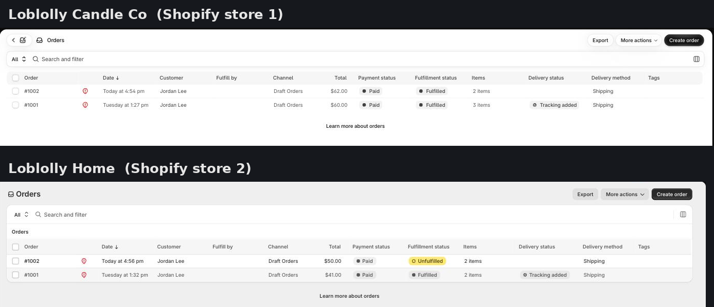
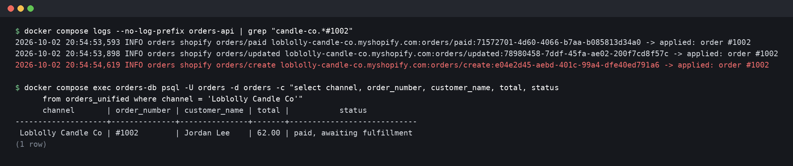
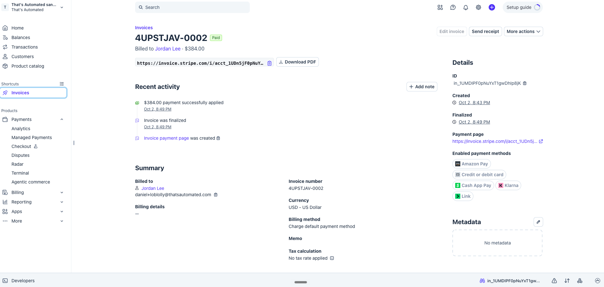
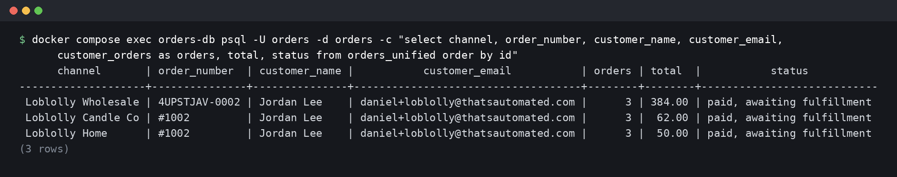
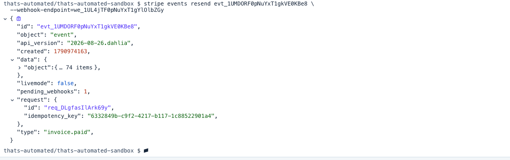
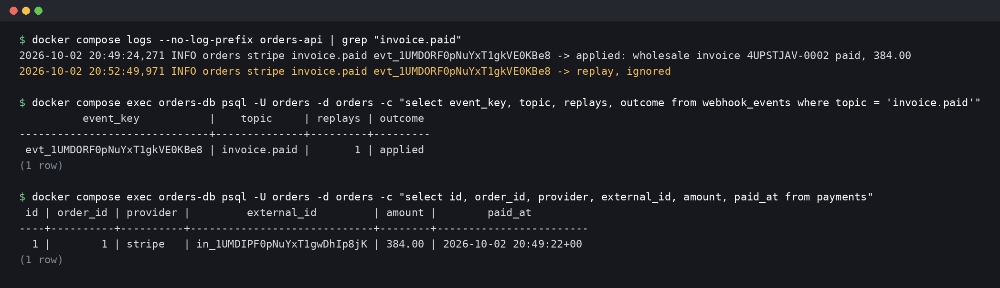
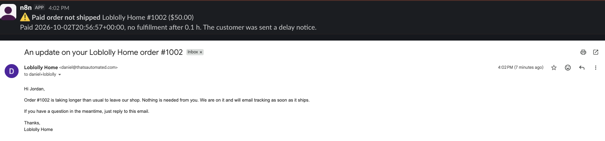
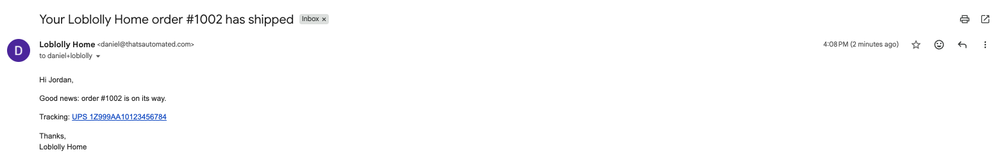
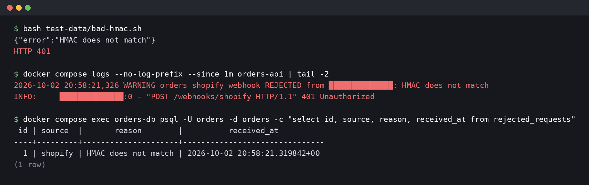
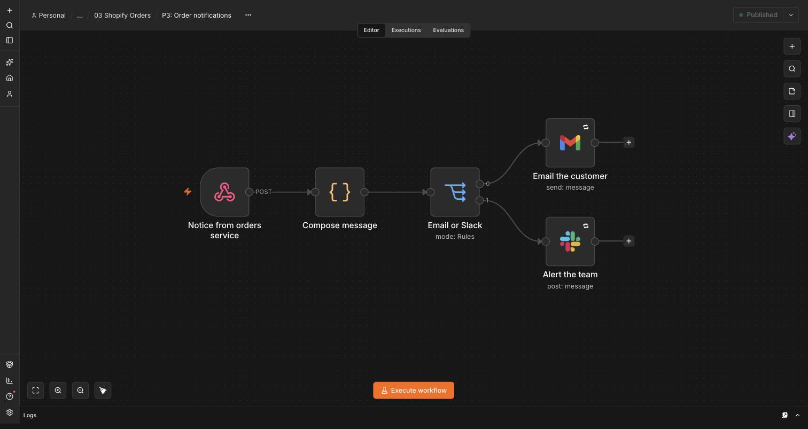

# 03 - Two Shopify stores and a wholesale channel, one source of truth

A small brand sells through two Shopify stores and invoices its wholesale accounts through Stripe. Each channel has its own admin, and until now someone copied everything into a spreadsheet to see the whole business. Here all three channels write to one Postgres schema on their own: one row per order, one customer per person no matter where they bought, refunds and fulfillments attached, and a sweep that notices the paid order nobody shipped.

Built on Shopify webhooks, Stripe webhooks (test mode), a small Python service (FastAPI) and Postgres on my own VPS, with n8n sending the customer emails and Slack alerts.

Status: built, deployed and tested end to end on live accounts (Sep 29, 2026). Walkthrough video recorded Oct 2, 2026, not yet published.

The demo business is Loblolly, a small candle maker: **Loblolly Candle Co** and **Loblolly Home** are the two Shopify development stores, and **Loblolly Wholesale** is boutiques that buy by the case on Stripe invoices.

## What this proves

- A webhook that isn't signed with the right key never touches the data. Shopify's HMAC and Stripe's signature are checked on the raw body in constant time, per store, and Stripe signatures older than five minutes are refused even when valid. Every rejection is logged with the reason.
- A replayed webhook changes nothing. Every accepted event is recorded under its event ID, and a second delivery is answered 200 and logged as a replay, so the sender stops retrying and there is still one payment row.
- The same buyer is one customer across both stores and wholesale, matched on normalized email.
- Webhooks arriving out of order don't corrupt anything. An older `orders/updated` can't overwrite a newer one, and a refund or fulfillment that shows up before its order is refused with a 503 so the sender retries it later, instead of being dropped.
- A missed webhook heals itself. Order payloads carry their refunds and fulfillments, and applying them is idempotent, so the next `orders/updated` fills in whatever was missed.
- The paid order that never ships gets noticed. A sweep marks it stuck, alerts the team once, and sends the customer one delay notice.
- Notifications can't get lost between here and n8n. They are written to an outbox in the same transaction as the change that caused them and delivered with retries and backoff; if n8n is down they wait.

## How it works

```
Shopify store A ─┐
Shopify store B ─┼─> /webhooks/shopify ─┐                      ┌─> n8n: shipped email
                 │                      ├─> Postgres ─> outbox ┼─> n8n: delay email
Stripe (invoices) ──> /webhooks/stripe ─┘      ^               └─> n8n: Slack #automation-alerts
                                               │
                                     sweep every 15 min
```

**Shopify** (`app/shopify.py`). Each store's webhooks are created in its admin under Settings > Notifications > Webhooks and point at `/webhooks/shopify`. The store is identified by `X-Shopify-Shop-Domain` and its own signing key is used to check `X-Shopify-Hmac-Sha256`. Topics used: `orders/create`, `orders/updated`, `orders/paid`, `orders/cancelled`, `refunds/create`, `fulfillments/create`, `fulfillments/update`. The event key is shop + topic + `X-Shopify-Event-Id`, because one checkout can fire several topics with the same event ID.

**Stripe** (`app/stripe_events.py`). Wholesale buyers get Stripe invoices. `invoice.paid` creates the wholesale order, its lines and the payment. `charge.refunded` records refunds against it, found through the payment intent. On Stripe API versions from 2025-03-31 on, the payment intent is no longer on the invoice, so `invoice_payment.paid` supplies the link; both shapes are handled. A refund that matches no wholesale payment raises an alert instead of guessing.

**Postgres** (`migrations/001_init.sql`). `channels`, `customers`, `orders` (unique on channel + external ID), `order_lines`, `payments`, `refunds`, `fulfillments`, `webhook_events`, `rejected_requests`, `notifications`, and the `orders_unified` view, which is the one table the video shows.

**Sweep** (`app/sweep.py`). Every 15 minutes: paid Shopify orders older than `STUCK_AFTER_MINUTES` with no successful fulfillment, not cancelled and not fully refunded, are marked stuck. Each gets one `stuck_alert` and one `delayed` notice (unique keys, so running the sweep again does nothing new). Wholesale is left out on purpose because it ships by freight on its own schedule. A Postgres advisory lock keeps two copies of the service from sweeping at once. `POST /admin/sweep` runs it on demand.

**Dispatcher** (`app/dispatcher.py`). Every 30 seconds, due notices are posted to the n8n webhook with an `X-Webhook-Key` header. 2xx marks them sent. Anything else waits 1, 2, 4, 8 ... minutes (capped at an hour) and gives up after 10 tries, which `/health` reports.

**n8n** decides the wording and the channel: shipped and delay emails to the customer, stuck and unmatched-refund alerts to `#automation-alerts`. That is the part a client will want to change, so it lives where they can change it.

## Test run (Sep 29, 2026)

Real events from both Shopify dev stores and a Stripe sandbox, one buyer (Jordan Lee) across all three channels:

| Step | What happened |
|---|---|
| Paid order #1001 on Loblolly Candle Co | `orders/updated` arrived before `orders/create`; both applied to one row. Customer created, two line items with SKUs |
| Fulfilled with a UPS tracking number | Order marked fulfilled, one "shipped" notice, n8n emailed Jordan with the tracking link |
| Paid order #1001 on Loblolly Home, email typed as `Daniel+Loblolly@ThatsAutomated.com` | Same customer record, not a second one (normalized email). Customer now shows 2 orders |
| Wholesale invoice 4UPSTJAV-0001 paid in Stripe ($384) | Third row, same customer (3 orders). `invoice_payment.paid` linked the payment intent, which on API 2026-08-26 is no longer on the invoice |
| `stripe events resend` on the invoice.paid event | 200, logged "replay, ignored", `replays = 1`, still one payment row |
| $96 partial refund in Stripe | `charge.refunded` found the order through the payment intent, `total_refunded = 96.00` |
| Loblolly Home order left unshipped past the threshold | Sweep marked it STUCK once (a second sweep marked nothing), Slack alert in #automation-alerts, delay email to Jordan |
| n8n workflow unpublished, then the stuck order fulfilled | Shipped notice failed with n8n's 404 and waited in the outbox (`/health` showed 1 pending). Workflow republished, notice delivered on attempt 2, order status STUCK to fulfilled |
| `test-data/bad-hmac.sh` | 401 "HMAC does not match", row in `rejected_requests` with the caller's IP |

## Walkthrough

Stills from a live run on Oct 2, 2026, in the order the video follows. The terminal images are drawn from the server's real output, with the sending IP address masked.

1. Two Shopify stores that don't know about each other.
   
2. Shopify sent "order updated" before "order created". It still lands as one row.
   
3. Wholesale orders are paid Stripe invoices.
   
4. One customer, three channels, one table.
   
5. Stripe resends a payment event. It is logged as a replay and ignored, so there is still one payment.
   
   
6. A paid order nobody shipped: the team is alerted and the customer gets a note, once.
   
7. Shipped, with tracking. The wording lives in n8n so the owner can change it.
   
8. A request without the store's signature is rejected and logged.
   
9. n8n only handles the customer and team messages.
   

## n8n workflow

`n8n/order-notifications.json` (credential IDs replaced with `REPLACE_WITH_` placeholders). Webhook with header auth, a Code node that writes the wording for each notice kind, then Gmail for customer emails or Slack for team alerts. It answers only after the email or Slack post succeeds (`responseMode: lastNode`), so a failed send returns an error and the service retries it.

## Run the tests

Needs Python 3.11+ and a Postgres the tests can create a database in.

```
pip install -r requirements-dev.txt
TEST_ADMIN_DATABASE_URL="postgresql://postgres@localhost:5432/postgres" pytest
```

## Deploy

On the VPS, next to n8n, behind the same Traefik:

```
cd 03-shopify-orders/deploy
cp .env.example .env      # fill in the secrets
docker compose up -d --build
curl https://orders.thatsautomated.com/health
```

Migrations run on start. The database is only on the compose network, not exposed.

## When it breaks

| What goes wrong | What happens |
|---|---|
| Stripe resends an event (`stripe events resend evt_...`) | 200, logged "replay, ignored", still one payment row |
| Someone posts a forged Shopify webhook (`test-data/bad-hmac.sh`) | 401, row in `rejected_requests` with the reason, valid webhooks keep landing |
| A store's webhook is signed with the other store's key | 401, each store has its own key |
| A paid order never gets a fulfillment | Sweep marks it stuck, one Slack alert, one delay email to the customer |
| n8n is down when a notice is due | Notice stays in the outbox and is retried with backoff until n8n takes it |
| A refund webhook arrives before its order | 503, nothing recorded, Shopify retries and it lands once the order exists |
| A refund arrives that matches no wholesale payment | Recorded as unmatched, Slack alert |
