# 08 - Zapier: a support inbox that answers what it knows and hands off what it doesn't

A text-message support line for a one-truck HVAC company, built entirely in Zapier. Routine questions are answered from a knowledge base in seconds. Emergencies bypass the AI completely. Anything the knowledge base does not cover goes to a person, and the person's answer is written back as a new rule, so the next customer gets it instantly.

Demonstration build. The company is fictional. It reuses the Project 4 GoHighLevel sub-account, phone number, and test contacts.

Status: built (Sep 25, 2026). Walkthrough video recorded Oct 2, 2026 on the n8n version of the same design, not yet published.

## What this proves

- An AI answering customer questions can be made to refuse rather than guess. The model is given retrieved rules and one customer record, and returns ESCALATE when the answer is not in that context.
- Safety-critical messages never touch the model. A keyword check runs before anything else, so "what's your rate for a gas smell call" takes the emergency path instead of the pricing path.
- The failure default is a person. The conversation row is created as PENDING_HUMAN before any work happens, so a dead step leaves a row that says someone owes a reply rather than a customer waiting on silence.
- The knowledge base is a spreadsheet the owner maintains, and it grows from the answers they are already typing.

## Why Zapier and not n8n

This is the same problem as Project 6, solved with a different tool on purpose. Zapier is the right answer when the client already pays for it, the volume is a few hundred messages a month, and the person maintaining the answers will never open a code editor. Tables gives them a knowledge base they edit like a spreadsheet. Interfaces gives them a queue page with no front end to build. The cost is that Zapier is worse at retries and has no test environment, so the guardrails have to be visible in the Zap itself. When the classification needs unit tests and traces, that is Project 6.

## Architecture

Inbound SMS (GoHighLevel) -> webhook -> Zap A
                                         |
                    keyword check --------+-------- everything else
                         |                               |
                  emergency path                  classify -> find rules (global)
                  no AI step                              -> find customer record
                  owner alerted                           -> Claude answers or ESCALATE
                                                                 |            |
                                                           reply to      queue page
                                                           customer      (queue view)
                                                                              |
                                                                 person answers -> Zap B
                                                                 sanitize -> new rule

Zap C watches Zap A for errors and sends the holding message if the responder dies mid-run.

### Tables

Three tables, schemas and seed rows in [`tables/`](tables/).

| Table | Tier | Purpose |
|---|---|---|
| `kb_rules` | global | Rules that apply to every customer. Looked up by category, not keyword, so one rule covers every phrasing. |
| `customers` | record | One row per customer, looked up by phone. Only that customer's row is ever passed to the model. |
| `conversations` | log and queue | Every inbound message, its status, the model's raw output, and the human answer. |

A customer whose number is not on file gets the global tier only. Any question that needs their record escalates instead of being answered from someone else's row.

### Zaps

| Zap | Trigger | Does |
|---|---|---|
| A. Inbound question responder | Catch Hook from GHL | Logs as PENDING_HUMAN, emergency keyword path, classify, retrieve, answer or escalate |
| B. Human answer to customer and knowledge base | Tables button click (`send`) | Sends the person's answer, and if marked reusable, sanitizes it into a new rule |
| C. Responder failed, default to human | Zapier Manager, new Zap error | Sends the holding message, marks the row FAILED, alerts the owner |

Zapier has no workflow export, so [`zaps/`](zaps/) holds screenshots of each Zap instead. The step-by-step build is in the implementation plan.

### Queue

No Interfaces project. The queue is a saved view on `conversations` called "Escalation queue", filtered to status PENDING_HUMAN or FAILED, sorted newest first, with phone and contact ID hidden. A person opens it from the link in the Slack alert, types the reply in `answer`, ticks `reusable` if it applies, and clicks `send`. The knowledge base is the `kb_rules` table itself, where learned rules show `source = human` and `reviewed` unchecked.

### Prompts

Three, in [`prompts/`](prompts/), pasted into the Zap steps unchanged. Every one wraps the customer message in tags so text in the message is data, not instruction. Test case 8 is the prompt-injection check.

## What breaks and what catches it

| Break | What catches it |
|---|---|
| Customer asks something the knowledge base does not cover | Model returns ESCALATE, customer gets a holding message, question lands on the queue page. No invented answer. |
| AI step fails (bad key, timeout, outage) | Zap C sends the holding message and alerts the owner. Autoreplay retries the original run. |
| Emergency phrased as a routine question | Keyword check runs before the model, so it takes the emergency path. |
| Person's answer contains customer details | Sanitize step strips names, numbers, addresses and dates before the rule is written. |
| Unknown number asks a record question | Customer lookup returns nothing, prompt gets NO RECORD ON FILE, model escalates. |

New rules go live immediately but unreviewed, and the owner can deactivate one in a click. Inactive until reviewed is safer for a business answering legal or medical questions, and is a one-checkbox change.

## Walkthrough

Stills from a live run of the n8n version, which is the same design, in the order the video follows. The Zapier editor stills are not taken yet.

1. A customer asks something the business answers every day.
   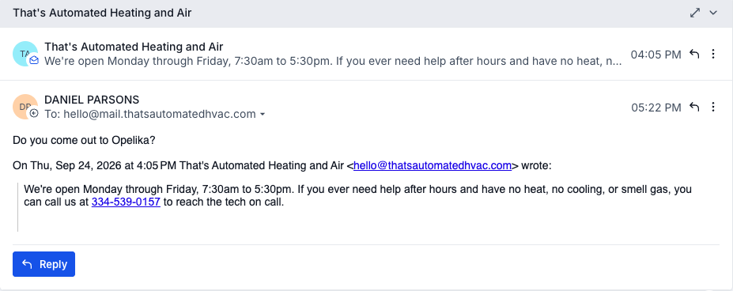
2. Answered from the business's own rules in seconds.
   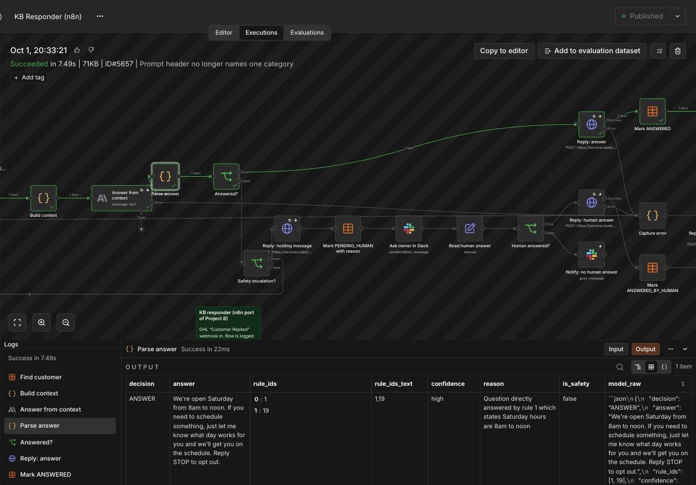
3. Account questions are answered from that customer's record and nobody else's.
   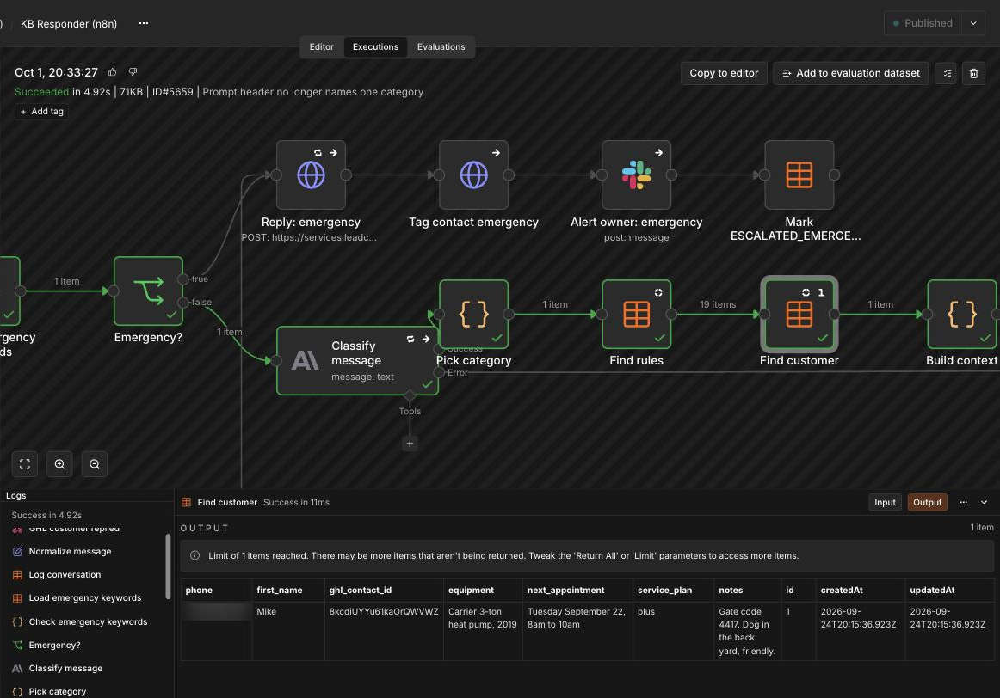
4. Not in the rules: it escalates instead of inventing an answer.
   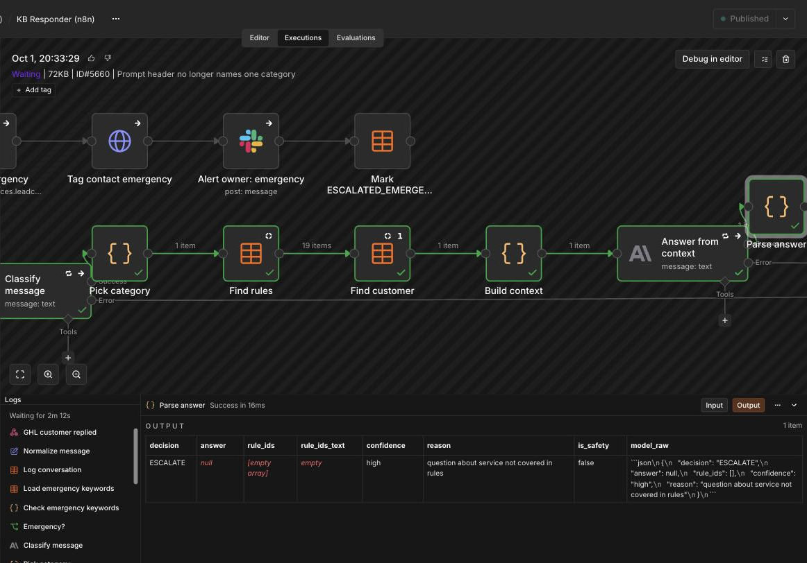
5. The owner answers in Slack.
   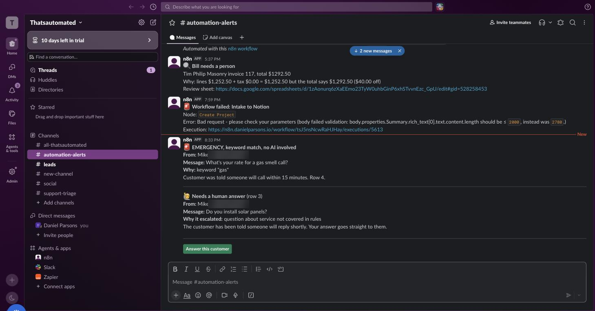
   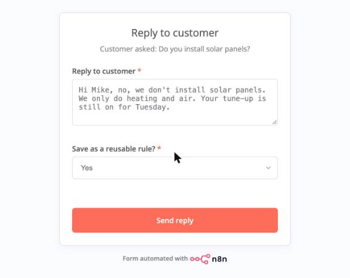
6. The answer becomes a general rule, with the customer's details stripped.
   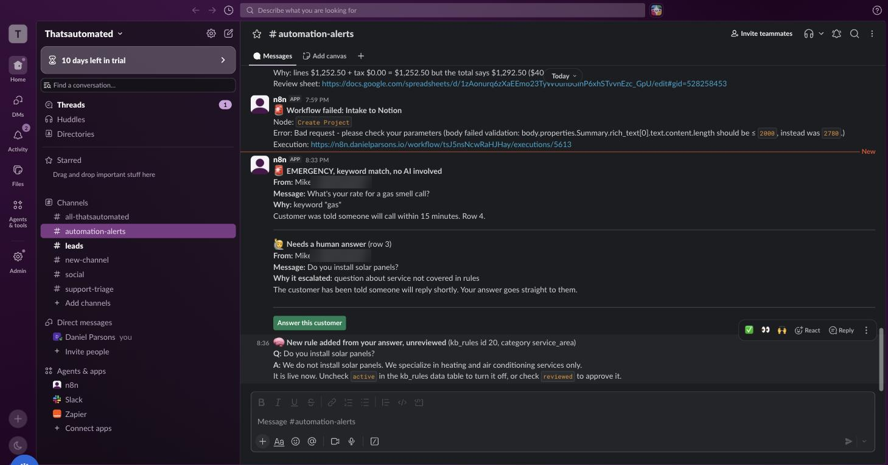
   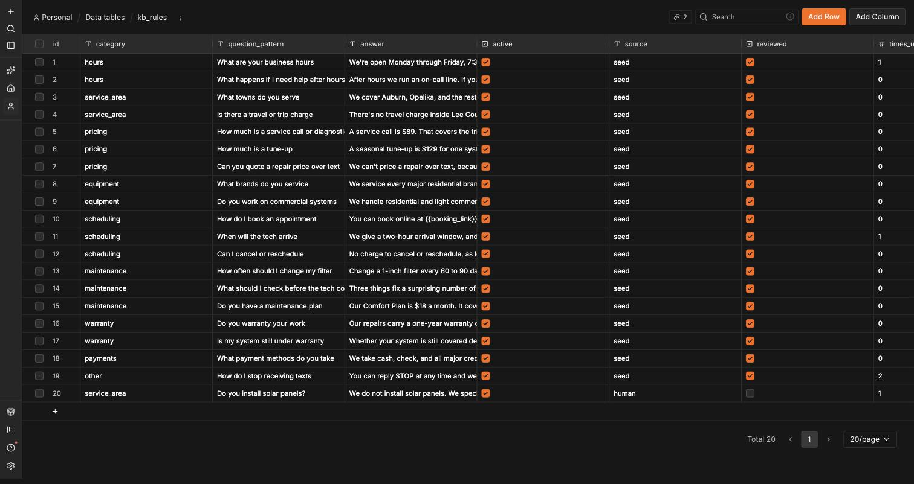
7. The next customer gets it straight away.
   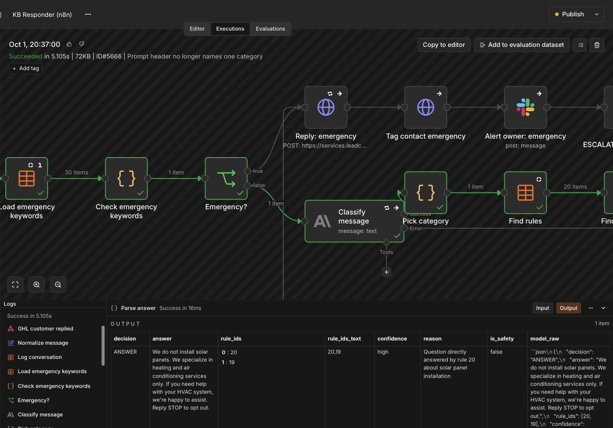
8. Emergencies skip the AI and alert the owner.
   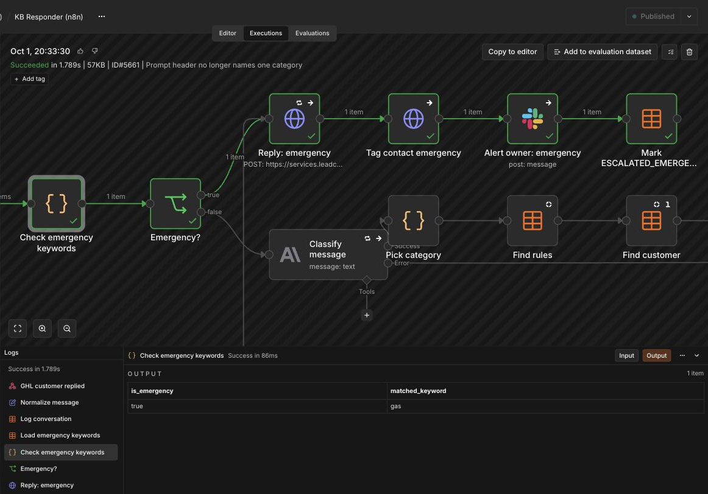
9. The AI step dies: the customer still gets a holding message and a person is told.
   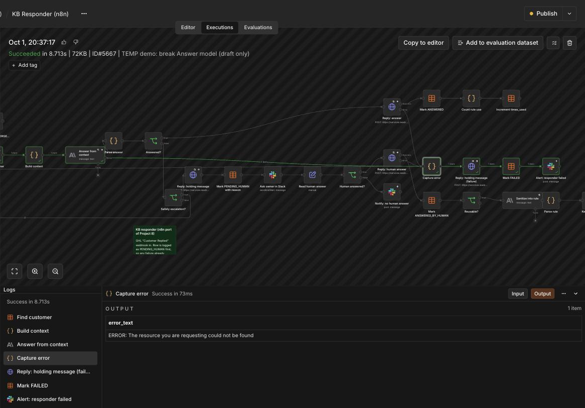
   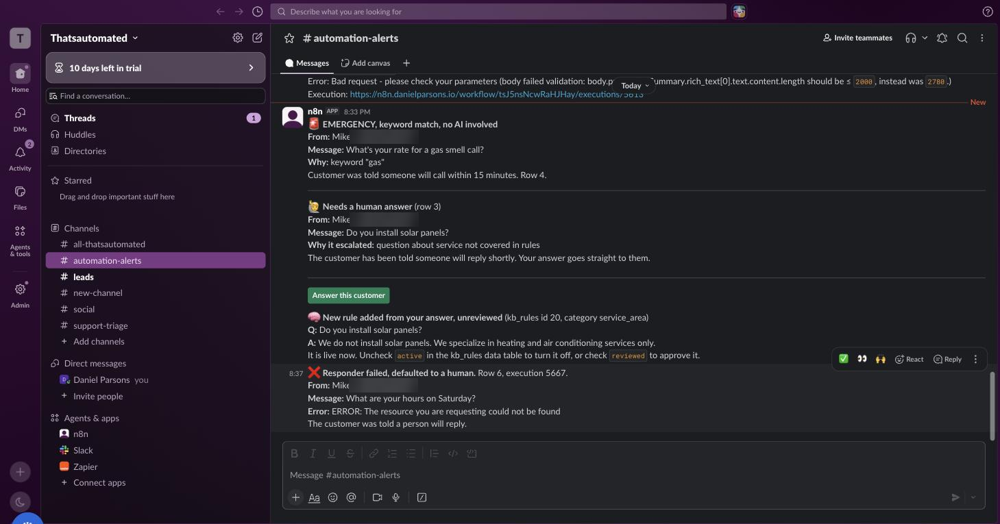
10. The whole workflow.
    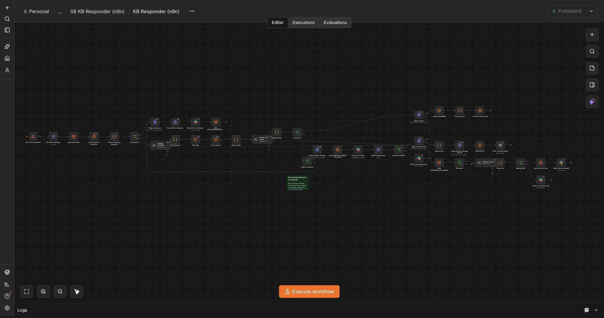

## Build checklist

- [x] Zapier account: Paths, Webhooks, Tables available
- [x] Three tables created, seeded from `tables/`
- [x] Escalation queue view on `conversations`, linked from the Slack alerts
- [x] GHL workflow "Customer Replied to Zapier" posting to the catch hook
- [x] Zap A
- [x] Zap B
- [x] Zap C
- [ ] Twelve test cases run, `conversations` screenshotted
- [x] Failure injection run (model name `x`, Zap C caught it)
- [x] Walkthrough video (recorded Oct 2, 2026 on the n8n version, not yet published)
- [ ] Site page, Upwork portfolio item, Zapier back in the Upwork skills list

## Notes

- Free Zapier Professional trial started Sep 14, 2026, two weeks. Everything through the Loom has to land inside that window.
- A2P 10DLC for the HVAC sub-account has not cleared, so the build and the tests run on email. GHL's Customer Replied trigger fires on inbound email too and the reply step posts an email message. Everything else is identical. Swap to SMS for the Loom if A2P lands in time.
- Task budget: a normal Path B run is about six billable tasks. Twelve tests, a dozen re-runs and the Loom fit inside the Professional tier.
- Sep 25, 2026: implementation complete. The self-learning loop is proven live: an escalated solar question was answered from the queue, sanitized into a `kb_rules` row with `source = human`, and the same question from the second contact was answered from that rule.
- Side-by-side n8n version of this build (Slack send-and-wait form instead of a table queue) finished Sep 24.
